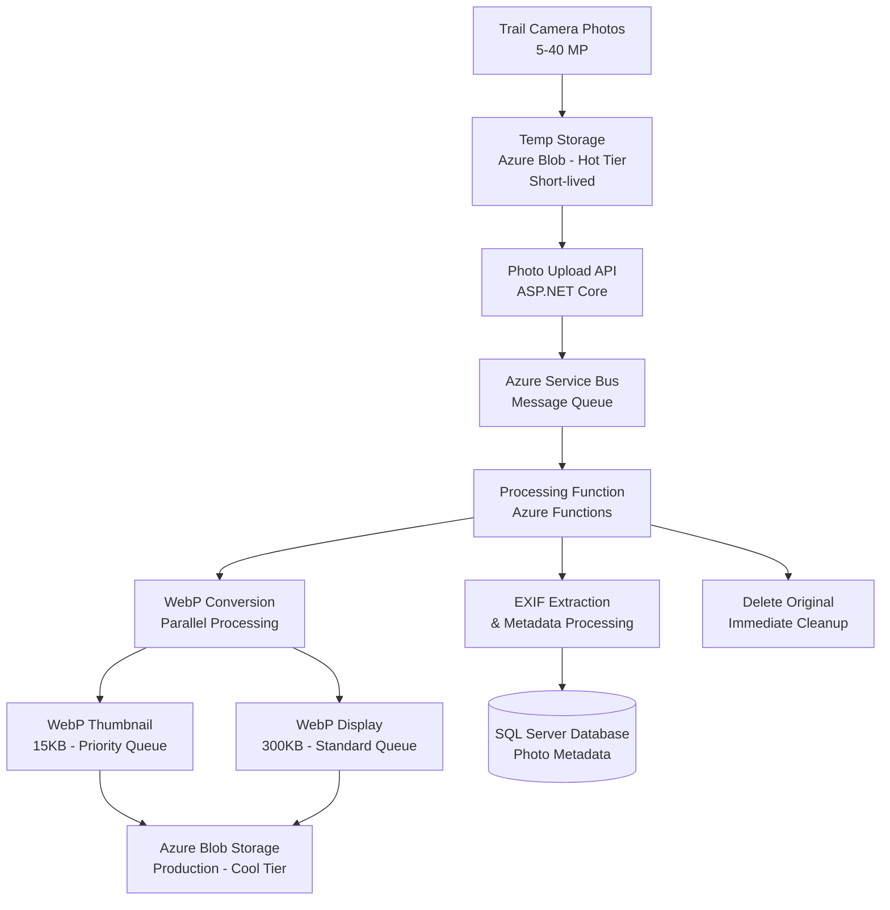

# Trail Camera Photo Processing Architecture

## Executive Summary

This document outlines the architecture and implementation plan for a scalable trail camera photo processing system that handles high-resolution images (5-40 MP), performs efficient processing with WebP conversion, and implements a queue-based architecture for near real-time thumbnail generation and slightly delayed display image processing.

## Architecture Overview



## Detailed Component Architecture

### 1. Ingestion Layer

#### Photo Upload API Endpoint
**Location**: `BuckScience.API/Controllers/PhotosController.cs`
- **Responsibilities**:
  - Receive multipart form uploads from trail cameras
  - Validate file types (JPEG, RAW formats)
  - Extract basic metadata (file size, upload timestamp)
  - Store temporarily in Azure Blob Storage (Hot tier)
  - Enqueue processing message
  - Return immediate acknowledgment with tracking ID

#### Temporary Storage Strategy
**Azure Blob Storage - Hot Tier Container**: `trail-camera-originals`
- **Lifecycle Policy**: Auto-delete after 24 hours
- **Access Tier**: Hot (for fast processing access)
- **Naming Convention**: `{cameraId}/{uploadTimestamp}-{guid}.{extension}`
- **Redundancy**: LRS (Locally Redundant Storage) - sufficient for temporary data

### 2. Message Queue Architecture

#### Azure Service Bus Topics & Subscriptions

**Primary Topic**: `photo-processing`

**Subscription 1**: `thumbnail-processing` (High Priority)
- **Filter**: `ProcessingType = 'Thumbnail'`
- **Max Delivery Count**: 3
- **Lock Duration**: 5 minutes
- **Time to Live**: 1 hour

**Subscription 2**: `display-processing` (Standard Priority)
- **Filter**: `ProcessingType = 'Display'`
- **Max Delivery Count**: 5
- **Lock Duration**: 10 minutes
- **Time to Live**: 24 hours

**Dead Letter Queues**: Separate handling for failed messages with alerting

#### Message Schema
```json
{
  "photoId": "guid",
  "cameraId": "int",
  "originalBlobUrl": "string",
  "processingType": "Thumbnail|Display",
  "priority": "High|Normal",
  "uploadTimestamp": "datetime",
  "retryCount": "int"
}
```

### 3. Processing Layer

#### Azure Function Apps

**Function App 1**: `TrailCameraProcessor-Thumbnails`
- **Hosting Plan**: Premium Plan (for consistent performance)
- **Trigger**: Service Bus Topic Subscription
- **Concurrency**: 10 concurrent executions
- **Timeout**: 5 minutes
- **Auto-scaling**: 1-20 instances based on queue length

**Function App 2**: `TrailCameraProcessor-Display`
- **Hosting Plan**: Consumption Plan (cost-effective for delayed processing)
- **Trigger**: Service Bus Topic Subscription
- **Concurrency**: 5 concurrent executions
- **Timeout**: 10 minutes
- **Auto-scaling**: Dynamic based on queue depth

#### Processing Workflow

1. **Message Dequeue & Validation**
   - Retrieve message from appropriate subscription
   - Validate blob existence and accessibility
   - Update processing status in database

2. **EXIF Extraction**
   - **Library**: `MetadataExtractor` NuGet package
   - **Extract**: DateTime Original, GPS coordinates, camera settings
   - **Fallback**: File creation time if EXIF DateTime missing
   - **Validation**: Ensure timestamp is reasonable (not future dated)

3. **Image Processing Pipeline**
   - **Load Image**: Using `ImageSharp` for efficient memory handling
   - **Orientation Correction**: Auto-rotate based on EXIF orientation
   - **Quality Assessment**: Check for corrupt/invalid images
   - **Parallel Processing**: Generate both sizes simultaneously when possible

4. **WebP Conversion Specifications**
   
   **Thumbnail Generation**:
   - **Target Size**: 15KB max file size
   - **Dimensions**: 200x150 pixels (maintain aspect ratio)
   - **Quality**: Dynamic (adjust to meet file size target)
   - **Processing Time**: < 30 seconds target
   
   **Display Image Generation**:
   - **Target Size**: 300KB max file size
   - **Dimensions**: 1920x1440 pixels max (maintain aspect ratio)
   - **Quality**: 85% WebP quality starting point
   - **Processing Time**: < 2 minutes target

5. **Storage & Cleanup**
   - **Upload to Production Storage**: Azure Blob Cool tier
   - **Update Database**: Photo metadata, processing status, blob URLs
   - **Delete Original**: Immediate cleanup from temp storage
   - **Send Completion Notification**: Optional webhook/SignalR update

### 4. Storage Layer

#### Production Blob Storage
**Container**: `trail-camera-processed`
- **Access Tier**: Cool (cost-effective for infrequent access)
- **Redundancy**: RA-GRS (Read-Access Geo-Redundant)
- **CDN Integration**: Azure CDN for fast global delivery
- **Naming Convention**: 
  - Thumbnails: `thumbnails/{cameraId}/{year}/{month}/{photoId}-thumb.webp`
  - Display: `display/{cameraId}/{year}/{month}/{photoId}-display.webp`

#### Database Schema Extensions

**Enhanced Photo Entity**:
```csharp
public class Photo
{
    // Existing properties...
    
    // New properties for trail camera processing
    public long OriginalFileSizeBytes { get; set; }
    public string? OriginalFileName { get; set; }
    public DateTime? ExifDateTaken { get; set; }  // From EXIF data
    public ProcessingStatus ProcessingStatus { get; set; }
    public string? ThumbnailBlobUrl { get; set; }
    public string? DisplayBlobUrl { get; set; }
    public long ThumbnailSizeBytes { get; set; }
    public long DisplaySizeBytes { get; set; }
    public int ProcessingRetryCount { get; set; }
    public string? ProcessingErrorMessage { get; set; }
    public DateTime? ProcessingStartedAt { get; set; }
    public DateTime? ProcessingCompletedAt { get; set; }
    
    // EXIF metadata
    public string? CameraExifModel { get; set; }
    public string? CameraExifMake { get; set; }
    public decimal? ExifLatitude { get; set; }
    public decimal? ExifLongitude { get; set; }
    public string? ExifOrientation { get; set; }
}

public enum ProcessingStatus
{
    Uploaded,
    Queued,
    ThumbnailProcessing,
    DisplayProcessing,
    Completed,
    Failed,
    RequiresRetry
}
```

### 5. Monitoring & Observability

#### Application Insights Integration
- **Custom Metrics**: Processing times, queue depths, error rates
- **Performance Counters**: Memory usage, CPU utilization
- **Custom Events**: Processing pipeline stages
- **Alerts**: Queue backup, processing failures, storage quota

#### Health Checks
- **Queue Health**: Monitor subscription message counts
- **Storage Health**: Verify blob accessibility
- **Database Health**: Connection and query performance
- **Function Health**: Execution success rates

#### Business Metrics Dashboard
- **Processing Throughput**: Photos processed per hour
- **Quality Metrics**: File size achievement rates
- **Performance Metrics**: Average processing times by type
- **Cost Metrics**: Storage costs, compute costs per photo

## Implementation Timeline

### Phase 1: Foundation (Week 1-2)
- [ ] Set up Azure Service Bus namespace and topics
- [ ] Configure Azure Blob Storage containers with lifecycle policies
- [ ] Extend Photo entity with processing-related properties
- [ ] Create database migration for new schema
- [ ] Implement basic photo upload API endpoint

### Phase 2: Core Processing (Week 3-4)
- [ ] Develop Azure Function for thumbnail processing
- [ ] Implement EXIF extraction functionality
- [ ] Create WebP conversion pipeline using ImageSharp
- [ ] Set up Azure Function for display image processing
- [ ] Implement original file cleanup mechanism

### Phase 3: Queue Integration (Week 5)
- [ ] Integrate Service Bus message publishing in upload API
- [ ] Configure Function App Service Bus triggers
- [ ] Implement retry and dead letter handling
- [ ] Add processing status tracking in database

### Phase 4: Production Hardening (Week 6-7)
- [ ] Add comprehensive error handling and logging
- [ ] Implement Application Insights telemetry
- [ ] Set up monitoring dashboards and alerts
- [ ] Performance testing and optimization
- [ ] Configure auto-scaling policies

### Phase 5: Advanced Features (Week 8)
- [ ] Implement batch processing for multiple photos
- [ ] Add image quality assessment and filtering
- [ ] Create administrative dashboard for monitoring
- [ ] Set up automated testing and deployment pipelines

## Performance & Scalability Considerations

### Throughput Targets
- **Thumbnail Processing**: 100 photos/hour sustained, 500 photos/hour peak
- **Display Processing**: 50 photos/hour sustained, 200 photos/hour peak
- **Storage Efficiency**: 95% achievement of target file sizes

### Scalability Strategy
- **Horizontal Scaling**: Function Apps auto-scale based on queue depth
- **Storage Partitioning**: Organize blobs by camera and date for optimal access
- **Database Optimization**: Index on CameraId, DateTaken, ProcessingStatus
- **CDN Caching**: Cache processed images globally for fast access

### Cost Optimization
- **Storage Tiering**: Hot → Cool → Archive based on access patterns
- **Function Hosting**: Mix of Premium (thumbnails) and Consumption (display)
- **Message Retention**: Minimal TTL to reduce Service Bus costs
- **Compression**: WebP format significantly reduces storage costs

## Security Considerations

### Access Control
- **Managed Identity**: Function Apps access storage without connection strings
- **RBAC**: Principle of least privilege for all Azure resources
- **Network Security**: Private endpoints for storage accounts
- **API Security**: Authentication required for upload endpoints

### Data Protection
- **Encryption**: At-rest and in-transit encryption for all data
- **Data Retention**: Configurable retention policies for processed images
- **Privacy**: No permanent storage of GPS coordinates without user consent
- **Audit Trail**: Complete processing history for compliance

## Error Handling & Recovery

### Retry Strategies
- **Transient Failures**: Exponential backoff with jitter
- **Image Corruption**: Automatic detection and user notification
- **Storage Failures**: Cross-region failover for critical operations
- **Processing Timeouts**: Graceful degradation with manual retry options

### Disaster Recovery
- **Backup Strategy**: Geo-redundant storage for processed images
- **Recovery Time Objective**: < 4 hours for full service restoration
- **Recovery Point Objective**: < 1 hour data loss maximum
- **Failover Testing**: Monthly disaster recovery exercises

This architecture provides a robust, scalable solution for trail camera photo processing that meets all specified requirements while maintaining cost efficiency and operational excellence.